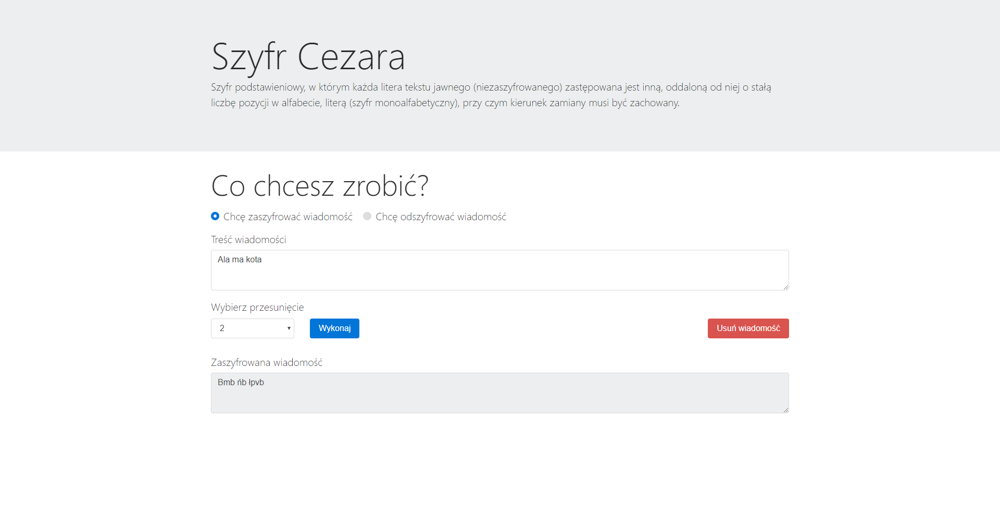
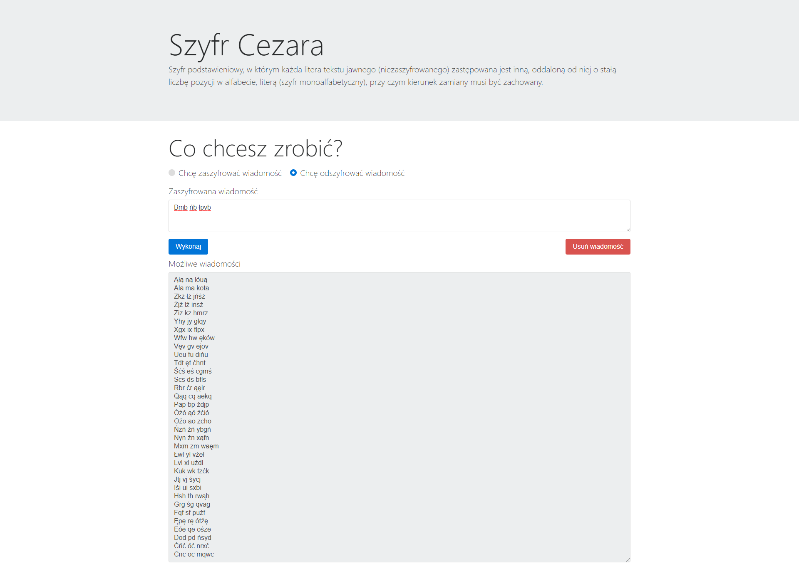

# caesar-cipher

![License][license-url] ![Version][version-url] ![Done][done-url] ![Created][created-url]

### Caesar Encoder & Decoder

#### Internet application that encodes / decodes messages using Caesar's encryption. An undoubted advantage is the ability to change the shift in encoding and display all possible combinations of messages as a result of decoding. The application uses Latin alphabet extended by Polish characters.

[license-url]: https://img.shields.io/badge/license-Apache%202-green.svg?style=plastic "License"
[version-url]: https://img.shields.io/badge/version-1.0.0-yellowgreen.svg?style=plastic "Version"
[done-url]: https://img.shields.io/badge/done-yes-yellow.svg?style=plastic "Yes"
[created-url]: https://img.shields.io/badge/created-11.2017-orange.svg?style=plastic "November"
